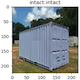
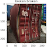

# Python tool to classify containers (broken, not-broken) with Keras(Tensorflow)

### An application of how to recognize the transportability of containers based on the insights we gained from a port in Germany. Here is what we learned.

We can predict the intactness of containers with the help of Machine Learning in a fully automated way. This is the outcome in a nutshell.

  
  

Damage to containers can be caused by natural wear or overstressing physical and chemical nature. 
This in particular during transport, by material fatigue or by improper handling. Already existing material defects promote the occurrence of further defects. In addition to their appearance and functionality, they can also impair the safety of use of the containers. The damage occurs essentially as cracks, deformations or as separated parts. Due to the liability of the logistics company, the need to develop and use effective methods of damage detection is evident. 

The classic fields of engineering, such as mechanical engineering, civil and aircraft engineering have been developing numerous methods for the early detection of damage of all kinds for quite some time. In addition to methods in the fields of acoustics and vibration analysis, optical recognition is particularly suitable for damage detection.

Visual classification can be done with relatively new algorithms such as Artificial Neural Networks (CNNs). This works particularly well, since containers have unique characteristics due to the lamella width, depth and direction. But there is also variations in paint, dirt and wear, which makes the classification in the event of damage more difficult.

### Demo output: Visualization of machine classification

We have trained the machine with 300 pictures of broken and defect containers (equal weighted). Even with such a small amount of training samples, the machine was able to identify the broken containers at high precision.  

If the output is identical (broken: broken) or (intact: intact), then the classification is correct. In the example above, all defect containers were labeled correct, but a few intact containers marked as defect. At site, the containers labeled “broken” by the machine would be manually checked and confirmed by a person as “good for transport” or “repair”. Therefore, the system can used to support your current staff and to save cost. We assume manual checking of containers for transportability at site can be reduced up to a factor of ~20.

Assuming a port has 10 defect containers per week, scanned in several positions, the operator would therefore quickly reach a sufficient amount of training material. We currently do not have sufficient picture material, but the technology and the knowledge to implement the classification algorithm. 

If you are interested in automatically validating the transportability of containers passing through your port, please reach out.

